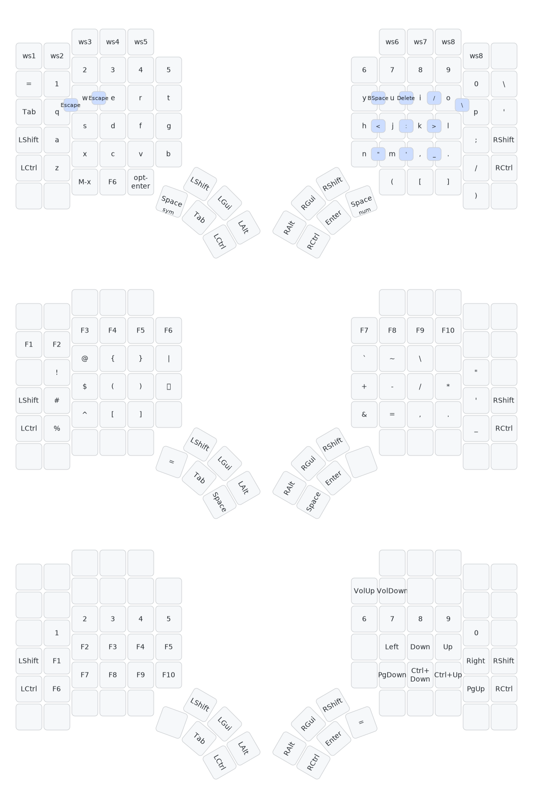

# Rust firmware for the Glove80 keyboard

https://github.com/user-attachments/assets/1223476b-7622-4224-8fc1-0153b41fe684

Rusty glove is firmware for the Glove80 split keyboard written in Rust
using the Embassy framework.

## Layout

## Features

- Normal keypresses, mod taps, layers, chords, mouse keys
- Some pretty neopixel animations (that sync between sides, and transition smoothly)

## Building

Building is best done using the dev shell of the nix flake, it loads everything in that you need to build the project.

Then use `just both` to invoke the rules in the justfile for producing a `both.uf2` file.

## Keymaps

You can use https://github.com/simmsb/keylayout to generate key layouts (and
also generate previes of them), check out the [one I use](layouts/rusty-glove.kl)
